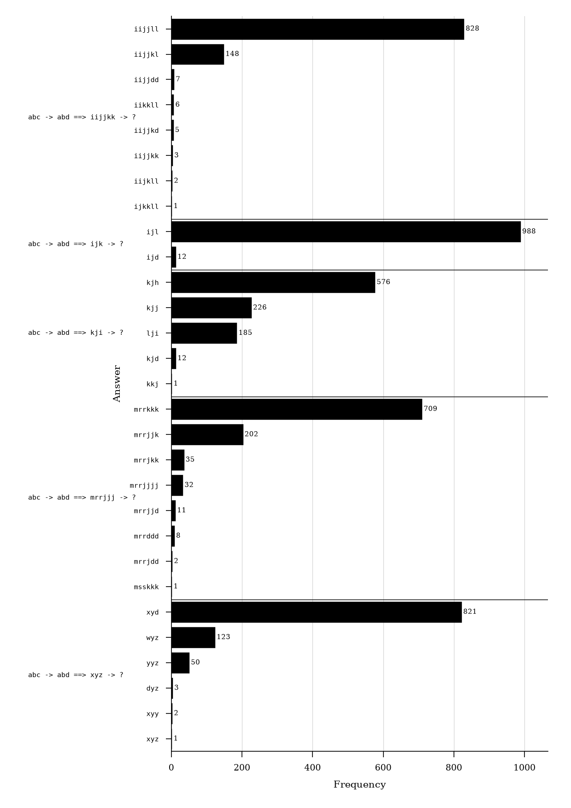
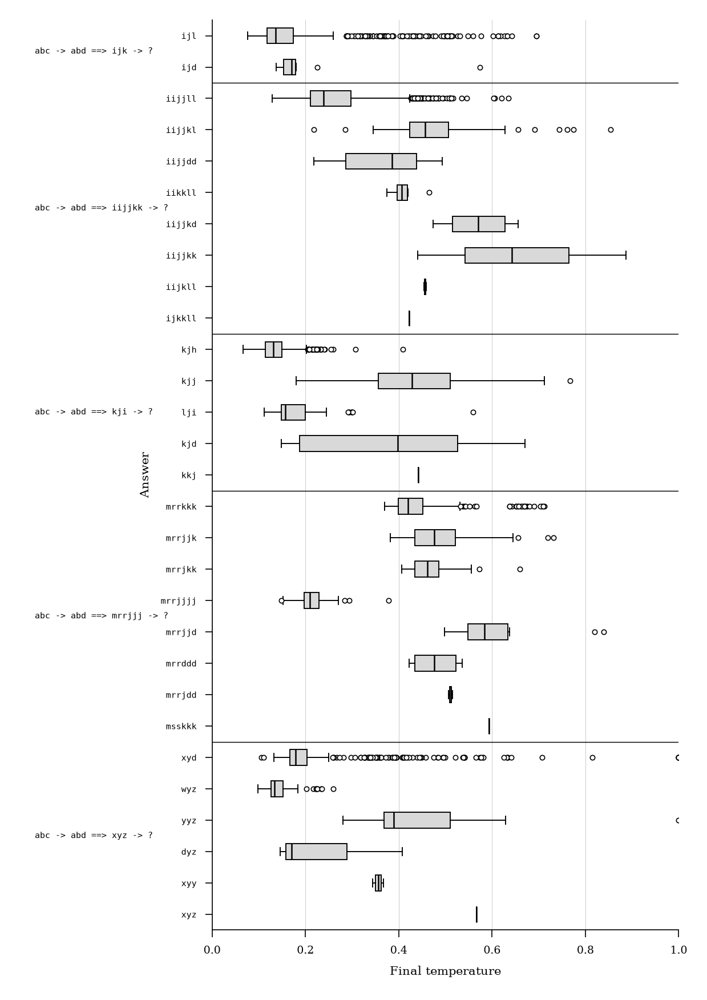
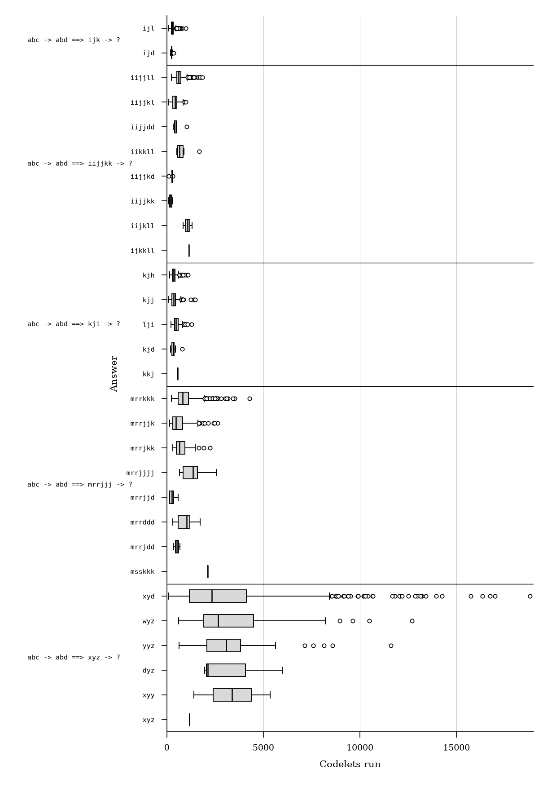
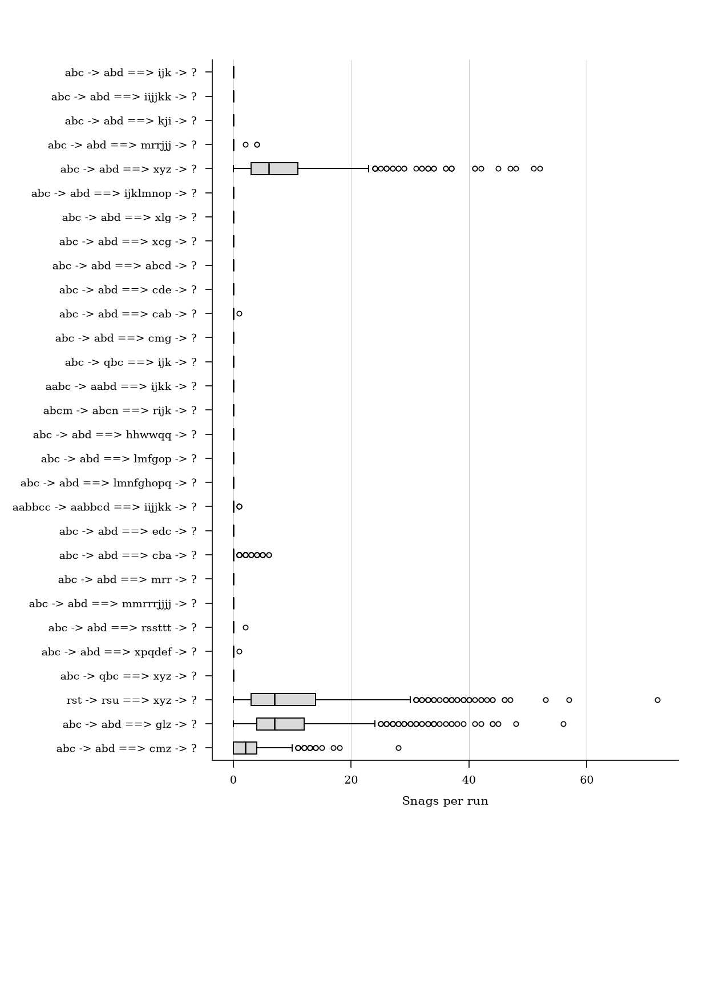
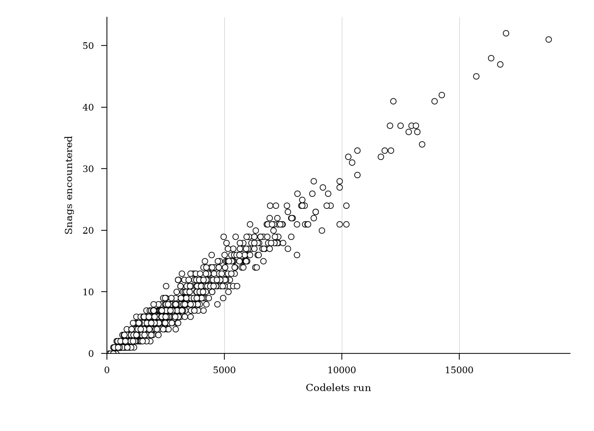

# Paper Title

**George Alexander Wright**

## Abstract

Write the abstract here.

# Introduction

This paper describes a reproduction study of Copycat, a computer model of analogy-making that solves string analogies of the form "if _abc_ is transformed to _abd_, what is _ijk_ transformed to?" [@Mitchell1993].
Copycat is based on research by Douglas Hofstadter and his Fluid Analogies Research Group (FARG) into the flexible use of concepts by humans when they perceive and think about the world.
While the original implementation of Copycat is available online, it is written in a dialect of Lisp that is not compatible with the standard implementations available today and makes use of now non-existent dependencies.

The Python re-implementation of Copycat described herein is the first step in a project that aims to construct a general library for building "Fargitecture" models so that they can continue to be experimented on and better understood.
Copycat makes a good starting point for this research program as it is one of the best-documented models and it informed subsequent models produced by FARG and others.

A full statistical comparison of the Python re-implementation with previously documented behaviour shows it to be a close approximation to the original Lisp Copycat.
The Python re-implementation has made it possible to show that the quantization of values in Copycat have a meaningful impact on the efficiency of its search for a solution.
It has also made possible a further statistical and critical analysis of Copycat's encounters with and approach to handling _snags_ when solving certain problems.

# Background

Copycat is a workspace-based architecture in which a problem is represented by graph-like data structures that are operated on by a series of micro-agents called _codelets_ that make incremental changes to the workspace structures such as proposing, building, or destroying new connections or groupings until more coherent structures are built that lead towards a solution to the original problem. Once a codelet has run, it can propose another codelet to do follow-up work and it places this on a _coderack_ which is a stochastic priority queue. The program also contains a symbolic network of spreading activation called a _slipnet_ whose nodes receive activation from the workspace and can post codelets to the coderack when they are active. Events such as codelet selection happen with a degree of randomness determined by the program's changing _temperature_, a measure of the quality of structures in the workspace. The program lacks a central orchestrator and choices are made as a result of the interactions of many small components.

Copycat was originally motivated by Hofstadter's desire for more cognitively plausible Artificial Intelligence models that focus on the flexible way that concepts form and change as people think. Hofstadter and Mitchell describe Copycat and related architectures as models of _high level perception_ and place them in between the levels modeled by low level neural/connectionist and high level logic-based approaches to AI which had become two sides in a long-standing debate in both AI and Cognitive Science research. It fits into the _middle out_ approach to AI described by Wang and friend as opposed to the top-down or bottom-up.

Copycat and similar computer models produced by the Fluid Analogies Research Group appeared on the scene at a time when expert systems based on logic and rules were increasingly seen to have failed as an approach to AI and when neural networks were first producing successful results (but before they were as successful and as widely adopted as they are today).

Being both conceptually and chronologically sandwiched between these two large competing camps is perhaps one reason why the Copycat architecture and its underpinning ideas were not more widely adopted in AI research. Other substantial problems include the practical difficulty in building a program like Copycat. As described above it is a complex systems with many interacting components and is therefore difficult to debug. Furthermore, the models of the Fluid Analogies Research Group were focused on _micro-domains_ (also disparagingly known as _toy problems_) and while they may make convincing abstract theoretical models of important cognitive processes such as analogy-making and pattern recognition, the challenge of applying these approaches in practical domains is significant.

Despite this, Copycat can be seen to prefigure some important trends in contemporary AI and its increasing orientation towards a synthesis of neural and symbolic methods:

- *In-context learning* Hofstadter initially described Copycat as a model of learning, but the FARG approach was generally excluded from the machine learning community which was focused on the use of statistical techniques to induce rules or functions to predict correct labels or regressions from datasets. More recently, with the discovery that large language models can learn new tasks at inference time, there is increasing interest in this kind of in-context or few-shot machine learning, whereby examples given in a prompt can be used to teach a model a skill that was not present in the original training set. Copycat is in essence a _one-shot_ learner: it is given one example string transformation, uses it to form an abstract rule for string transformations, and applies that rule to a new string.

There has also been an increasing recognition that not all problems worth solving have a single correct answer that a model can be trained to predict. (Perspectivist manifesto)

- *Tool use* Beyond natural language processing, LLMs are now typically used within so-called _agentic_ systems which give the model access to external tools such as web search, calculators, program interpreters, or other more specialized neural networks. This allows them to augment their context beyond the initial prompt using information that could not be reliably produced from decoding the model (e.g. with facts that post-date the model's training data or with the results of novel calculations). In such a system the tools and context play a similar role to the codelets and workspace found in Copycat, but a computationally expensive (and therefore energy-intensive) LLM is also required to plan, orchestrate, and compile tool outputs into an answer. In Copycat responsibility for co-ordination is distributed between codelets and slipnet nodes with only lightweight mediation by the coderack's scheduling.

An agentic system with Copycat-like distributed orchestration between perhaps smaller language models or other neural networks might have the potential to reduce expensive LLM calls while also expanding the flexible behaviour of Copycat beyond its micro-domain. This warrants further research into the Copycat architecture so that it can be further experimented on and better understood. But further research has been hampered by the lack of a Copycat implementation that can be run in modern programming environments. This was the motivation for the reproduction study described in this paper.

## Summary of FARG

## Description of original Copycat

## Related work

# Methods

## Implementation

Main differences include use of floating point numbers for values such as activation, strength, temperature; different coderack removal; use of a matrix to define connections in the slipnet so that spreading activation could benefit from a parallelised GPU back-end in future; use of a modular object-oriented style of code to aid future abstraction of components into a library.

## Experimental Setup

Five target problems and 24 variations with record of answer distributions over 1000 runs as well as mean final temperature and standard error of final temperature for each answer and mean number of codelets run and standard error of codelets run for each problem.

Describe datasets, configurations, parameters, hardware, random seeds, or other relevant experimental details.

We can also perform further analysis than that considered by Mitchell, including time taken by codelets and share of activity by codelet types.

# Results

Present the main results.

## Figures

## Comparison statistics

| Measure                         |   Value |
|:--------------------------------|--------:|
| Mean answer TV distance         |   0.022 |
| Max answer TV distance          |   0.058 |
| Temperature mean absolute error |   0.010 |
| Temperature max absolute error  |   0.078 |
| Temperature RMS z               |   1.150 |
| Temperature max \|z\|           |   3.913 |
| Codelets-run relative error     |   0.071 |
| Codelets-run RMS z              |   3.857 |

Table: Across-problem statistics comparing the Copycat reproduction with the original implementation over all 29 target and variation problems. The full per-problem comparison and solution summaries are supplied in the reproduction dataset. {#tbl:comparison-statistics}

## Answer distributions

The reimplementation of Copycat outputs similar answers with similar frequency to the original implementation. For all 29 problems, the most frequent answer is identical between the two implementations (TODO check) and all commonly occurring answers output by one implementation are also output by the other with similar frequency.

Table @tbl:comparison-statistics quantifies the similarity of answer distribution between the two distributions with total variation distance (TV distance). Each answer distribution is represented as a probability vector, with one component for each answer observed in either distribution. TV distance is half the sum of the absolute differences between corresponding answer probabilities. A distance of zero indicates identical distributions; values closer to 1 indicate greater discrepancy. The inverse of TV distance gives an estimate of the probability mass overlap between the two implementations. The average TV distance across all problems is 0.022, indicating a mean probability mass overlap of nearly 98%. Overlap is (slightly) below 95% for just two of the 29 problems tested.

Some answers which occur in fewer than 1% of cases in the original distribution do not appear in the reimplementation's distribution; likewise some new answers are produced by the reimplementation, but never more than a handful of times. This is however to be expected across a large number of runs of a stochastic model.

## Final temperatures

As well as producing an answer, Copycat also provides a final temperature score, which summarizes the strength and connectedness of structures in the workspace and can act as an approximate measure of answer quality. Because answers can be generated as a result of different underlying structures or with other structures present that do not contribute to an answer, the same answer generated many times can be accompanied by a range of final temperatures (Figure X shows the range of temperatures for answers to each of the five target problems). Over one thousand runs, an accurate reproduction of Copycat should not only produce a similar distribution of answers, but also a similar distribution of temperature scores for each answer.

In most cases, the final temperatures output by the reproduction are indeed similar to those of the original implementation. The difference between reproduction and reference temperature for each problem's solution (the absolute error) is usually close to zero and the size of the difference is usually acceptable considering the variance recorded in reference results.

Table @tbl:comparison-statistics reports the mean and maximum of absolute error for the temperatures associated with the answers of each problem. Only answers produced in more than 1% of outputs for a problem by the original implementation are considered to avoid undue emphasis on outliers. The mean absolute error across all 29 problems is 0.01, with mean temperatures rarely more than one percentage point away from those of the original implementation. The maximum error across all 29 problems is 0.078, with only five problems showing a maximum error above 0.05. The average z-statistic of 1.15 indicates that the temperatures are on average within just over one standard error from the reference mean temperature, an indication that the reimplementation distribution broadly matches that of the original.

## Run lengths

For each problem, Mitchell [@Mitchell1993] also reports the mean codelets run (and standard error) when Copycat is given that input. It is therefore possible to check if effort (in terms of codelets run) is comparable between the two implementations.

The reimplementation has a similar distribution of codelets run with the original. The relative error is close to zero (relative error is appropriate here as the number of codelets that could be run is unbounded, whereas absolute error is appropriate for comparisons of temperature which is always on the fixed scale between 0 and 1).

The mean relative error in codelet counts is higher than the mean absolute error for temperature. This is tolerable as the quantity and exact identity of codelets run is path dependent and can vary substantially depending on the structures built and the changing temperature during the run. Since the stochasticity of the program prevents exact reduplication of these results, codelets run can be expected to vary more noticeably from the originally recorded results.

## Snags

Sometimes when solving a problem, Copycat can encounter a _snag_ (also referred to as an _impasse_). This happens when a rule is built that cannot be applied to the letters in the target string. For example, when producing a solution for the problem `abc -> abd ==> xyz`, Copycat might construct a rule to replace the letter `z` with its successor. Since `z` has no successor, Copycat cannot apply the rule.

In describing the workings of the Copycat architecture, Mitchel [@Mitchell1993] does not provide great detail of how snags are recognized and handled or how often they occur for each problem (other than that they occur on average 9 times per run for the `xyz` problem, page 133). In fact, Copycat never encounters snags for most of its problems and only encounters snags for solutions relating to the end of the alphabet or for groups with different numbers of letters. Snag handling runs as part of answer construction which occurs deterministically once a rule translator codelet has built a rule for producing an answer.

When a snag is hit, Copycat clamps its temperature to maximum, marks structures in the workspace as _snag structures_, deletes any proposed structures, deletes the translated rule, clamps the activation of descriptors of the object, and enters a _snag state_. It then periodically checks (every 15 codelets) whether or not to leave a snag state and unclamp temperature and descriptors by checking if newly built structures are identical to the structures present when the snag state was entered. This aspect of Copycat runs deterministically and takes a more global view of the workspace. This is a slight deviation from the broader style of the architecture in which responsibility for observing and editing the workspace is usually delegate to codelets stochastically selected from the coderack. The logic is also quite tailored to a specific type of problem.

Handling snags allows Copycat to continue trying to find a solution. As noted by Mitchell p.133 this can often result in the same problematic structures being retried, something which humans can also be prone to when they try to solve hard problems. This can be seen in Figure x where the relatively mundane answer to `abc -> abd ==> xyz -> xyd` has a very wide distribution of run lengths. This is largely down to repeated snags occurring when the program tries to find the successor to `z`. Figure y shows a high correlation between snags encountered and codelets run. Runs of the program with many snags typically involve many more codelets being run.

Snags are addressed further by Metacat, an extension of Copycat which Marshall describes as having _self-watching_ capabilities.

## Coderack removal method comparison

| Measure                               |   Fixed weighted removal |   Faithful original removal |
|:--------------------------------------|-------------------------:|----------------------------:|
| Mean answer TV distance               |                    0.022 |                       0.025 |
| Max answer TV distance                |                    0.058 |                       0.086 |
| Temperature mean absolute error       |                    0.010 |                       0.012 |
| Temperature max absolute error        |                    0.078 |                       0.127 |
| Temperature RMS z                     |                    1.150 |                       1.229 |
| Temperature max \|z\|                 |                    3.913 |                       4.617 |
| Codelets-run relative error           |                    0.071 |                       0.080 |
| Codelets-run RMS z                    |                    3.857 |                       4.166 |
| Mean snag count on snaggable problems |                    3.086 |                       3.097 |
| Max snag count                        |                       72 |                          91 |

## Numeric quantisation comparison

| Measure                               |   Full precision |   Two-decimal quantisation |
|:--------------------------------------|-----------------:|---------------------------:|
| Mean answer TV distance               |            0.022 |                      0.021 |
| Max answer TV distance                |            0.058 |                      0.055 |
| Temperature mean absolute error       |            0.010 |                      0.011 |
| Temperature max absolute error        |            0.078 |                      0.085 |
| Temperature RMS z                     |            1.150 |                      1.055 |
| Temperature max \|z\|                 |            3.913 |                      3.423 |
| Codelets-run relative error           |            0.071 |                      0.033 |
| Codelets-run RMS z                    |            3.857 |                      1.693 |
| Mean snag count on snaggable problems |            3.086 |                      3.079 |
| Max snag count                        |               72 |                         64 |

There is very little difference between the outputs of the version of Copycat using full precision Python floating point numbers and the version with floating point numbers quantized to 2 decimal places. The quantized version produces a distribution of answers that is slightly closer to the original while the full precision version produces slightly closer temperature measures for its answers.

The main difference between the two is evident in run-length. In this experiment, quantization is implemented by a program patch that adds a rounding step whenever any floating point number is assigned to an object's attribute (e.g. the temperature, slipnode activations, and workspace structure strength values). There can therefore be no advantage to quantization in terms of memory usage (the same underlying data type is used) or to wall-clock run-time (the rounding step is an extra operation). Nevertheless, there is a substantial impact in terms of the number of codelets run: using two decimal point quantization more than halves the relative error in codelets run and brings the distribution of run lengths more in line with that described for the original implementation. Problems prone to snags also see fewer snags on average and in the worst case.

Rounding values in the program introduces slight changes at which values cross certain thresholds. Many of these values are used to calculate codelet urgencies which determine the urgency bin that each codelet is placed in. Successive rounding up and down may have increased separation between beneficial and harmful structures, slipnodes, and codelets and reduced time spent exploring pathways that do not lead to a solution.

# Discussion

## Limitations

This paper has generally avoided discussion of statistical significance. Whereas it would be desirable to see no statistically significant difference between the outputs of the original and its reproduction, over 1,000 runs on each of 29 problems, it is highly likely that a result will show as statistically significant. This paper therefore focuses on the small effect sizes regardless of their significance. In some cases, it is also not clear what the suitable null hypothesis should be.

# Conclusion

# Acknowledgements

# References
